<div align="center">


# 点墨 Dianmo

*A phone-style Chinese touch keyboard for Surface and other Windows tablets.*

**指尖一点，落字成墨**

为 Surface 等 Windows 触屏设备打造的中文输入法：拆掉键盘之后，打字也能像在手机上一样顺手。

[](https://github.com/yzfly/dianmo/releases/latest)
[](LICENSE)
[](#安装)
[](https://www.rust-lang.org)

[下载安装](#安装) · [功能](#功能) · [使用技巧](#使用技巧) · [常见问题](#常见问题) · [从源码构建](#从源码构建)

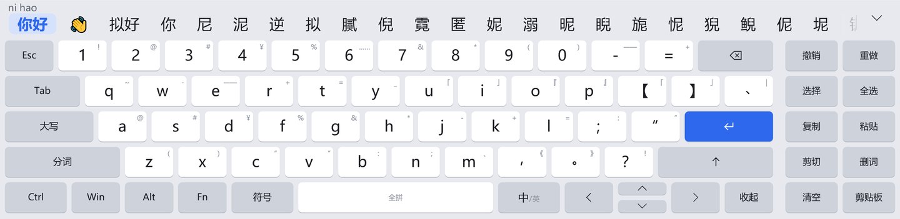

<sub>Surface 横屏下的宽屏布局：常驻数字行、电脑按键、右侧编辑区，候选词就在键盘上。</sub>

</div>

## 为什么做点墨

Surface 拆掉键盘后只剩触屏，而 Windows 上的中文输入是为实体键盘设计的：

- **系统触摸键盘不顺手**：又宽又大，两只手要大范围移动；没有九宫格，双拼也不方便。
- **候选框是给鼠标用的**：第三方输入法的候选词在一个小浮窗里，手指很难点中。
- **语音输入要靠实体键**：微信输入法、豆包输入法的语音都要按住 Ctrl+Win、右 Alt 这类按键才能开始，纯触屏用不了。
- **选字、复制、粘贴很难受**：Windows 触屏上的选区把手小、长按菜单难点。

手机屏幕更小，输入却更好用：候选词就在键盘上、按键有反馈、手势多、一键语音、键盘弹出时页面自动让位。点墨把这些搬到了 Windows 上。

## 功能

### 手机式键盘

- **四种布局**：全拼、小鹤双拼（键面小字标注韵母）、九宫格拼音、English，另有符号面板（中文 / 英文 / 表情）和数字面板。
- 拼音引擎是 [librime](https://github.com/rime/librime)，词库和方案来自 [雾凇拼音 rime-ice](https://github.com/iDvel/rime-ice)，开箱即用，词库在打包时已预编译，首次启动不用等。
- 候选条横向滑动，点右侧箭头展开成全屏候选网格；按键有放大气泡；两只拇指同时打字不丢键。
- 输入框获得焦点时弹出，离开时收起；数字输入框自动切到数字面板。

<table>
  <tr>
    <td width="50%">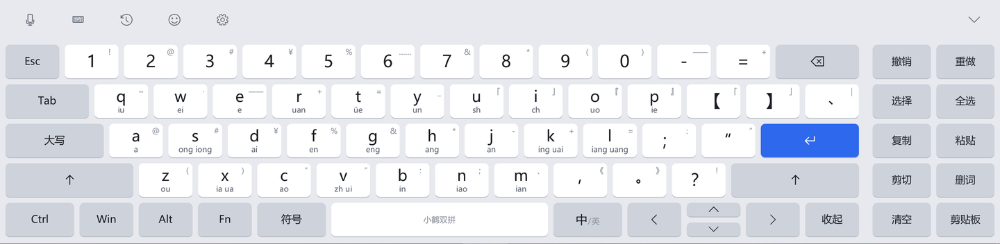</td>
    <td width="50%">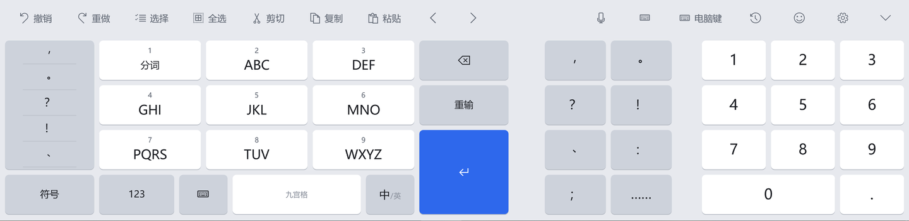</td>
  </tr>
  <tr>
    <td align="center"><sub>小鹤双拼：键面标注韵母</sub></td>
    <td align="center"><sub>九宫格：右侧常用标点和数字小键盘</sub></td>
  </tr>
</table>

### Surface 宽屏布局

键盘宽度超过约 1100 DIP（如 Surface 横屏）时，自动换成五行的宽屏布局，把多出来的宽度用来放更多的键，而不是把每个键拉宽：

- **常驻数字行**：数字直接点就上屏，不用长按，也不用切到 123 面板。
- **电脑按键**：Esc、Tab、大写、Ctrl、Win、Alt、Fn、方向键都在键盘上。
- **修饰键三种按法**：点一下是单次（只作用于下一个键）；双击锁定，再点一下松开；按住修饰键，用另一根手指点别的键，就是真正的组合键。可以叠加，例如 Ctrl+Shift+T。锁定的 Ctrl / Alt / Win 会一直按着，比如锁定 Alt 后连点 Tab，可以在任务切换界面里一个个往后选，解锁时切过去。
- **快捷键提示**：按下 Ctrl 或 Win 后，字母键下方用小字提示常用组合（全选、复制、粘贴、撤销、保存、查找……）。
- **Fn 层**：数字行变成 F1–F12，方向键变成 Home / End / PgUp / PgDn，⌫ 变成 Del。

<table>
  <tr>
    <td width="50%">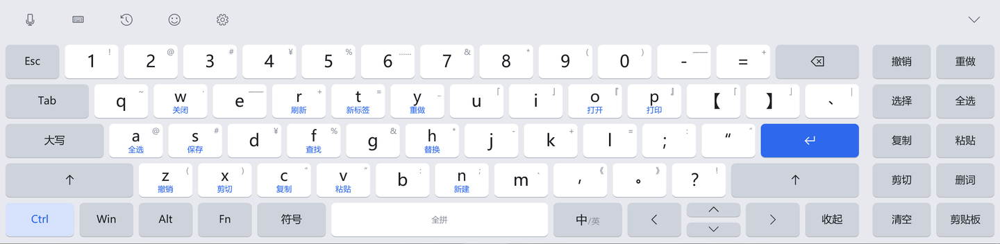</td>
    <td width="50%">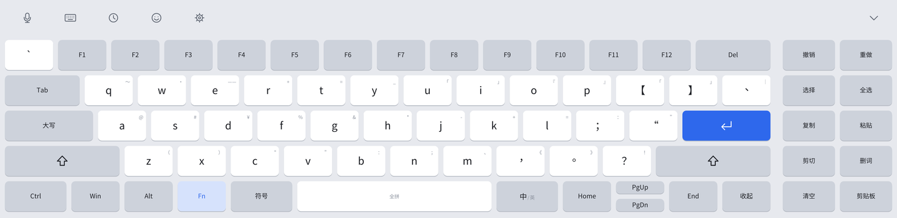</td>
  </tr>
  <tr>
    <td align="center"><sub>按下 Ctrl：键面提示常用快捷键</sub></td>
    <td align="center"><sub>Fn 层：F1–F12、Home / End / PgUp / PgDn</sub></td>
  </tr>
</table>

### 电脑键盘模式

一块触屏版的笔记本键盘（六行，含 F1–F12、PrtSc、倒 T 方向键）。这个模式下点墨不组字，每个键的按下和抬起直接发给系统，和插了一块实体键盘一样：

- 目标应用当前的输入法（微信输入法、搜狗、微软拼音……）照常工作；
- 按住键会自动连发；按住 Alt 连点 Tab 可以停在任务切换界面；
- 适合终端、快捷键很多的软件，以及想继续用自己习惯的输入法的时候。

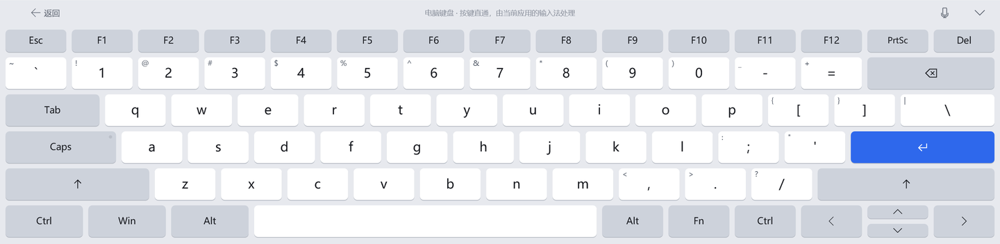

### 编辑与剪贴板

- **右侧编辑区**（宽屏，可在设置里关掉）：撤销、重做、选择、全选、复制、粘贴、剪切、删词、清空、剪贴板。
- **触控板**：长按空格，整块键区变成触控板，拖动手指移动光标；这时用另一根手指点一下就开始选择，再拖动扩大选区。
- **选择栏**：按字、按词、按行扩选，选到行首 / 行尾、全选，然后复制、剪切、粘贴或删除。
- **剪贴板**：复制后候选条变成剪贴板卡片，点一张就粘贴；「全部」打开剪贴板历史，长按卡片可以固定或删除。
- **跳过敏感内容**：密码框里的复制、密码管理器标记为不记录的内容，都不进历史。

<table>
  <tr>
    <td width="50%">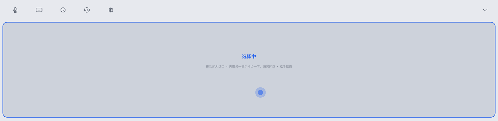</td>
    <td width="50%">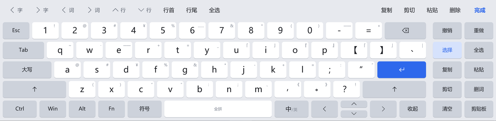</td>
  </tr>
  <tr>
    <td align="center"><sub>长按空格：触控板，另一指点一下开始选择</sub></td>
    <td align="center"><sub>选择栏：按字 / 词 / 行扩选</sub></td>
  </tr>
  <tr>
    <td width="50%">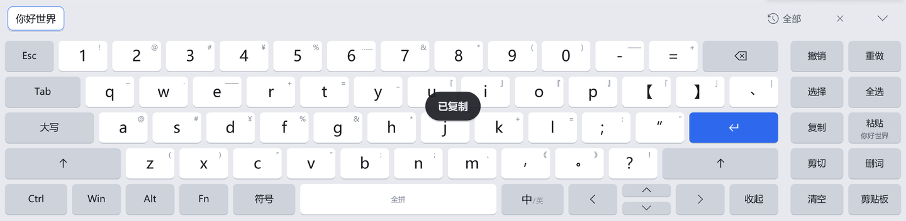</td>
    <td width="50%">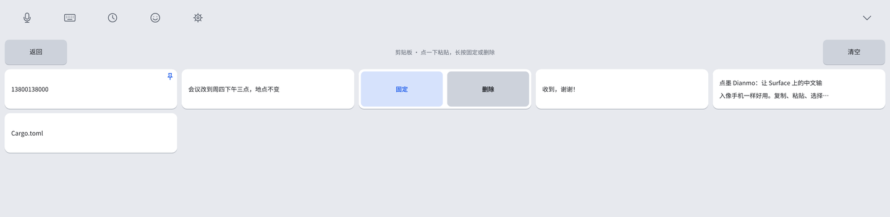</td>
  </tr>
  <tr>
    <td align="center"><sub>复制后：剪贴板卡片，点一下就粘贴</sub></td>
    <td align="center"><sub>剪贴板历史：长按固定或删除</sub></td>
  </tr>
</table>

### 语音

点墨自己不带识别模型，而是替你按下已安装的输入法的语音快捷键，让纯触屏也能「点一下说话」：

- **微信输入法**（默认，推荐）：点麦克风键开始，再点一下结束，识别准、带标点。
- **豆包输入法**：暂时用不了。实测豆包输入法 0.9 不响应模拟的按键（右 Alt+空格、按住右 Alt 都没反应），点墨调不起它的语音，等它支持后再接通。
- 也支持第三方的「豆包语音」小工具，以及手动选择 Windows 自带的语音输入（Win+H）。
- **语音球模式**：整个键盘缩成一个悬浮球，点一下说话、再点一下结束，长按展开键盘。以语音为主的时候，这是点墨最小的形态。
- 语音进行时麦克风键和语音球会亮起；引擎没装好或没有开始收音时，会直接告诉你原因。

### 悬浮球、不抢焦点、不遮挡

- **不抢焦点**：点键盘不会让正在打字的应用失去焦点和光标。
- **点输入框自动弹出**：手指点到可以打字的地方就弹出，点别处自动收起（用鼠标点不会弹出）。
- **不遮挡**：键盘显示时占用屏幕底部，最大化的窗口会自动缩上去，就像手机把页面顶上去；有应用全屏时，键盘自动退到它后面。
- **管理员窗口也能用**：点墨通过「以最高权限运行」的计划任务启动，在管理员 PowerShell 等窗口里也能自动弹出、正常打字（需要安装时同意一次管理员权限）。
- **悬浮球**：键盘收起后，屏幕边缘有一个小球，点一下呼出键盘；可以拖到左边或右边；闲置时缩小变淡，并且离屏幕边缘留一点距离，从边上拖它不会误触系统的边缘手势。
- **和系统触摸键盘不打架**：点墨运行时关掉系统触摸键盘的自动弹出，退出时恢复原样。

### 设置、新手引导、深浅色

正经的设置窗口：常规、键盘、输入、语音、剪贴板、关于六页，即改即生效，手指可以滚动；语音引擎、管理员窗口支持这些状态都有提示，有问题的地方给「一键修复」。第一次启动有四屏新手引导（选布局、选语音引擎、常用手势）。键盘和设置窗口都有浅色、深色两套主题，可以跟随系统。

<table>
  <tr>
    <td width="50%">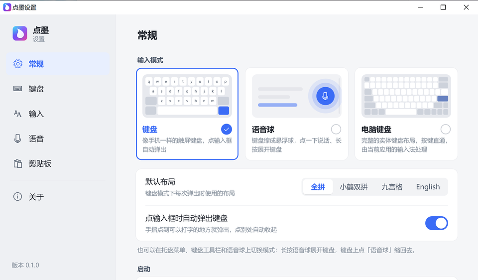</td>
    <td width="50%">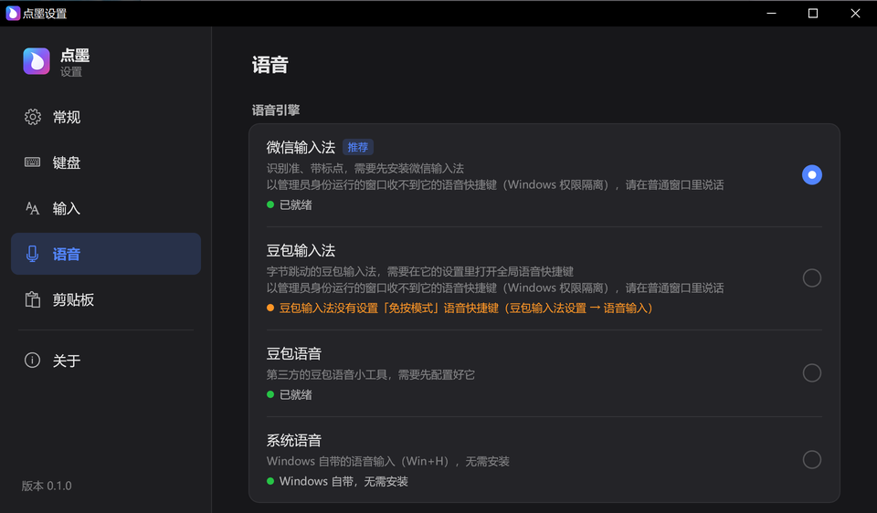</td>
  </tr>
  <tr>
    <td align="center"><sub>设置 › 常规：键盘 / 语音球 / 电脑键盘三种输入模式</sub></td>
    <td align="center"><sub>设置 › 语音（深色）：检测已安装的引擎</sub></td>
  </tr>
  <tr>
    <td width="50%">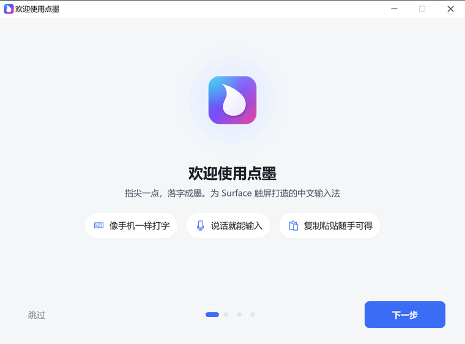</td>
    <td width="50%">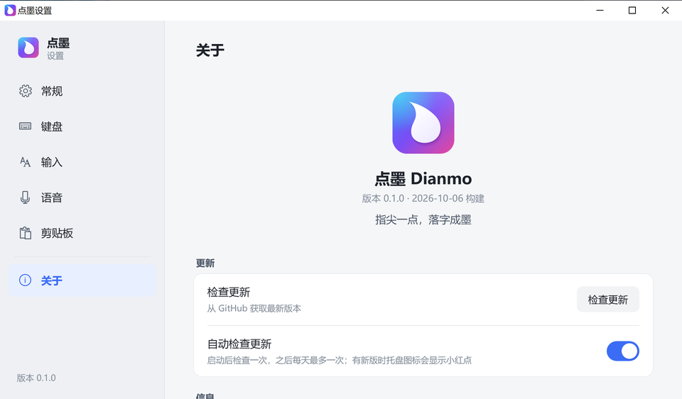</td>
  </tr>
  <tr>
    <td align="center"><sub>首次启动的新手引导</sub></td>
    <td align="center"><sub>关于：检查更新、反馈问题、导出诊断包</sub></td>
  </tr>
</table>

<details>
<summary>深色键盘</summary>

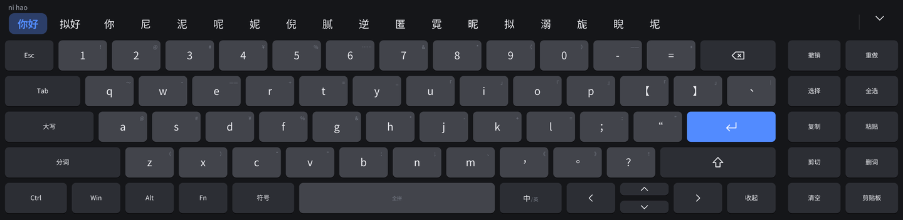

</details>

### 轻

在 Surface Pro 9（i7-1265U，2880×1920，200% 缩放）上实测：

| 项目 | 数据 |
|---|---|
| 空闲 CPU | 0（没有轮询、没有常驻动画，有事件才处理） |
| 内存（私有） | 键盘显示时约 32–35 MB；收起 5 秒后释放渲染资源，约 15 MB |
| 每次按键 | 拼音引擎处理平均 2–3 ms，全拼实测最长 4.9 ms |
| 启动 | 从启动到键盘可见约 0.2–0.3 秒 |
| 体积 | 安装包 20.8 MB，装好后约 49 MB（大部分是预编译的词库）；程序本身只依赖系统 DLL |

## 安装

1. 从 [Releases](https://github.com/yzfly/dianmo/releases/latest) 下载 `DianmoSetup-0.1.0.exe`，双击运行。
2. 安装包还没有代码签名，Windows SmartScreen 可能提示「Windows 已保护你的电脑」：点 **更多信息 → 仍要运行**。
3. 安装过程中会请求**一次**管理员权限：用来注册「以最高权限运行」的计划任务，这样点墨才能在管理员窗口里输入。拒绝也能正常安装和使用，只是不能给管理员窗口打字，以后可以在「设置 › 常规」里一键修复。
4. 装好后点墨自动启动，并打开新手引导。桌面和开始菜单有「点墨」，开始菜单还有「点墨设置」。

点墨安装在当前用户的 `%LOCALAPPDATA%\Dianmo`，不写系统目录。开机自启默认关闭，可在「设置 › 常规」里打开。「设置 › 关于」里可以检查更新，有新版时点一下即可下载安装。

**卸载**：在 Windows「设置 › 应用」（应用和功能）里找到「点墨」卸载。卸载时会询问是否保留个人数据（设置、词库、固定的剪贴板条目），并恢复系统触摸键盘的设置。

**系统要求**：Windows 10 1903 及以上或 Windows 11，x64；建议有触摸屏。目前主要在 Surface Pro 9（Windows 10 21H2）上开发和实测，其他设备欢迎[反馈](https://github.com/yzfly/dianmo/issues)。

## 使用技巧

**手势**

| 操作 | 效果 |
|---|---|
| 长按或上滑一个键 | 输入键面右上角的小字（符号；手机布局里第一行是数字） |
| 长按有多个副字符的键 | 弹出小面板，左右滑动选择 |
| 退格向左滑 | 清空正在输入的拼音 |
| 按住退格 | 连续删除，越删越快 |
| 空格左右滑 | 移动光标 |
| 长按空格 | 变成触控板，拖动移动光标 |
| 触控板中，另一根手指点一下 | 开始选择；再点一下按词扩选；松手后出现选择栏 |
| 输入中点标点 | 先上屏第一个候选，再输入标点 |
| 输入中按回车 | 原样上屏拼音或字母 |
| 长按 Tab | Esc |
| 点「复制」但没选中文字 | 自动进入选择模式 |

**修饰键（Shift / Ctrl / Alt / Win / Fn）**

| 按法 | 效果 |
|---|---|
| 点一下 | 单次：只作用于下一个键 |
| 双击 | 锁定：一直有效，再点一下松开 |
| 按住，另一根手指点其他键 | 组合键，和实体键盘一样 |
| Win 点一下 / 长按 | 点一下 = 打开开始菜单；长按 = 亮起，用来组合（截图：点 ⇧、Win、S） |
| 关闭窗口 | 点 Alt、Fn、F4 |

**悬浮球与托盘**

| 位置 | 操作 |
|---|---|
| 悬浮球（键盘模式） | 点一下或长按：呼出键盘；拖动：贴到左边或右边 |
| 悬浮球（语音球模式） | 点一下：开始 / 结束语音；长按：展开键盘 |
| 托盘图标 | 单击：显示或隐藏键盘 |
| 托盘菜单 | 显示 / 隐藏键盘、布局 ▸、语音引擎 ▸、输入模式 ▸（键盘 / 语音球 / 电脑键盘）、设置…、关于点墨、退出点墨 |

语音球模式下点输入框不会自动弹出键盘；想退出语音球，长按球展开键盘后，点工具栏最前面的「退出语音模式」，或在托盘「输入模式」里切回「键盘」。


## 常见问题

<details>
<summary><b>点麦克风没反应 / 语音不出字？</b></summary>

- **先确认装了对应的输入法**：选「微信输入法」就要装好微信输入法，选「豆包输入法」就要装好豆包输入法。「设置 › 语音」里会显示每个引擎的检测状态和原因。
- **豆包输入法**：要在它的设置里设好「免按模式」语音快捷键，并打开「全局语音快捷键」，否则在别的输入法的窗口里按不出语音。
- **管理员窗口里用不了第三方输入法的语音**：微信输入法、豆包输入法以普通权限运行，收不到发往管理员窗口的快捷键（Windows 权限隔离）。点墨会直接提示，请在普通窗口里说话。
- **微信输入法偶尔对快捷键没反应**：在任务管理器里结束微信输入法的进程，再在普通窗口里切换到微信输入法一次即可恢复。
- 点墨不会在失败时自动换成 Windows 自带的语音输入；想用它，在托盘「语音引擎」里手动选「系统语音」。

</details>

<details>
<summary><b>会和 Windows 自带的触摸键盘同时弹出来吗？</b></summary>

不会。点墨运行时会关掉系统触摸键盘的自动弹出，退出时恢复原来的设置；即使点墨意外退出，原来的设置也记着，下次正常退出或卸载时会恢复。

</details>

<details>
<summary><b>为什么需要管理员权限？</b></summary>

Windows 不允许普通权限的程序往管理员权限的窗口（比如管理员 PowerShell）里打字，也收不到这些窗口的焦点变化。点墨在安装时注册一个「以最高权限运行」的计划任务，之后每次通过这个任务启动，不会每次都弹 UAC。只有注册这个任务时需要你确认一次；拒绝的话点墨照样能用，只是不能给管理员窗口输入。

</details>

<details>
<summary><b>隐私：点墨会上传我的输入吗？</b></summary>

不会。拼音转换、词库、剪贴板都在本机处理，点墨不联网，唯一的例外是检查更新（访问 GitHub 的 Releases 接口，可以在「设置 › 关于」里关掉自动检查）。

- 剪贴板历史只在内存里，退出就没了；只有你手动固定的条目会存到本机的 `%APPDATA%\Dianmo\clips.txt`。
- 密码框里的复制、密码管理器标记为不记录的内容不会进历史；剪贴板历史也可以在设置里关掉。
- 「导出诊断包」只包含日志和设置，不含剪贴板和词库内容，路径里的用户名会被替换掉。
- 语音识别由你选择的输入法（微信输入法、豆包输入法等）完成，遵循它们各自的隐私政策。

</details>

<details>
<summary><b>已知限制</b></summary>

- 文字通过模拟键盘输入上屏，应用里没有内嵌的拼音预编辑（拼音显示在点墨的候选条上）。
- 只读扫描码的程序（部分游戏、远程桌面）可能收不到点墨打出的中文；可以试试「电脑键盘」模式。
- 宽屏布局里锁定 Alt 再连点 Tab，每次都是一个完整的 Alt+Tab；需要停在任务切换界面时，用「电脑键盘」模式按住 Alt。
- 设置里标着「即将推出」「下个版本生效」的项目（按键音、模糊音、候选字号等）还没有接通，见[路线图](#路线图)。

</details>

遇到问题请到 [Issues](https://github.com/yzfly/dianmo/issues) 反馈。最方便的方式是「设置 › 关于 › 反馈问题」，它会自动填好版本、系统和屏幕信息；也可以「导出诊断包」，把桌面上的 zip 拖进 issue。

## 从源码构建

点墨是一个 Rust workspace，Windows 程序用 `x86_64-pc-windows-gnullvm` 工具链构建，不需要 Visual Studio。

**环境**

- 最新的 Rust stable（至少 1.88，用到了 edition 2024 和 let chains），加上目标：`rustup target add x86_64-pc-windows-gnullvm`
- [llvm-mingw](https://github.com/mstorsjo/llvm-mingw)（提供 clang、lld），把它的 `bin` 加进 `PATH`
- `.cargo/config.toml` 已开启静态 CRT，生成的 exe 只依赖系统 DLL

**构建主程序**

```powershell
cargo build --release -p dianmo --target x86_64-pc-windows-gnullvm
```

**准备 Rime 数据**（librime 1.17.0 官方 Windows 版 + 固定版本的 rime-ice）

```powershell
# 下载 librime 和 rime-ice 到 C:\dev\dianmo-data（带 SHA-256 校验，可重复执行）
powershell -ExecutionPolicy Bypass -File scripts\rime\fetch.ps1
# 构建预编译工具，然后把 rime.dll 和预编译好的词库放到 dist 目录（首次预编译约 20 秒）
cargo build --release -p dianmo-rime --example probe --target x86_64-pc-windows-gnullvm
powershell -ExecutionPolicy Bypass -File scripts\rime\stage.ps1 -Out dist\Dianmo `
  -Probe target\x86_64-pc-windows-gnullvm\release\examples\probe.exe
copy target\x86_64-pc-windows-gnullvm\release\dianmo.exe dist\Dianmo\
```

没有 Rime 数据时点墨也能运行，只是用内置的「字母原样上屏」引擎。

**打安装包**

```powershell
cargo build --release -p dianmo-setup --target x86_64-pc-windows-gnullvm
target\x86_64-pc-windows-gnullvm\release\dianmo-pack.exe `
  target\x86_64-pc-windows-gnullvm\release\dianmo-setup.exe dist\Dianmo DianmoSetup-0.1.0.exe --version 0.1.0
```

**在 Linux 上开发**：界面和输入逻辑是纯 Rust，可以直接测试；Windows 部分只做类型检查。

```bash
cargo test --workspace
cargo check --workspace --target x86_64-pc-windows-gnullvm
# 渲染键盘预览图（需要 Noto Sans CJK 和 DejaVu Sans 字体）
cargo run -p dianmo-ui --example preview -- /tmp/dianmo-preview
```

**项目结构**

| 目录 | 说明 |
|---|---|
| `crates/dianmo-core` | 纯逻辑：引擎 / 上屏接口，手机输入法规则的状态机 |
| `crates/dianmo-ui` | 纯逻辑：键盘界面（布局、候选条、手势）、设置窗口、关于、新手引导，通过 `Canvas` 绘制 |
| `crates/dianmo-rime` | 运行时加载 `rime.dll`，实现拼音引擎；词库预编译 |
| `crates/dianmo-win` | Windows 平台层：不抢焦点的窗口、Direct2D 绘制、SendInput、焦点监听、AppBar、托盘、悬浮球 |
| `crates/dianmo` | 主程序：把以上组装起来；语音、剪贴板、设置、安装 / 卸载、检查更新、诊断 |
| `crates/dianmo-setup` | 安装包 `DianmoSetup-<版本>.exe` 和打包工具 `dianmo-pack` |
| `scripts/rime` | 下载和整理 Rime 数据 |
| `scripts/surface` | Surface 实机构建与测试脚本 |

设计与技术选型见 [docs/DESIGN.md](docs/DESIGN.md)，产品部件清单见 [docs/PRODUCT.md](docs/PRODUCT.md)，版本变化见 [CHANGELOG.md](CHANGELOG.md)。

## 路线图

- 按键音
- 模糊音（z/zh、c/ch、s/sh、n/l、an/ang 等）
- 用户词库导入、导出、清空；候选字号、全角标点等设置接通
- TSF 输入法客户端：应用内嵌的预编辑，更可靠的输入框识别
- 更多双拼方案（自然码、微软双拼等）
- 安装包代码签名

## 致谢

点墨站在这些开源项目的肩膀上：

- [librime](https://github.com/rime/librime)：中州韵输入法引擎，负责拼音到汉字的转换（随包附带官方 Windows 版 `rime.dll`）
- [雾凇拼音 rime-ice](https://github.com/iDvel/rime-ice)：词库和输入方案
- [OpenCC](https://github.com/BYVoid/OpenCC)：开放中文转换（librime 内置，用于 emoji 和简繁转换）
- [windows-rs](https://github.com/microsoft/windows-rs)：微软官方的 Rust Windows API 绑定
- [miniz_oxide](https://github.com/Frommi/miniz_oxide)：纯 Rust 的压缩库，用于安装包
- [tiny-skia](https://github.com/RazrFalcon/tiny-skia)、[ab_glyph](https://github.com/alexheretic/ab-glyph)：开发时渲染键盘预览图
- [Rust](https://www.rust-lang.org)：让点墨小巧、快速、省电

## 许可证与作者

[GPL-3.0](LICENSE)（GPL-3.0-or-later）· 开发者 **云中江树**（GitHub [@yzfly](https://github.com/yzfly)）

第三方组件和数据遵循各自的许可证。
